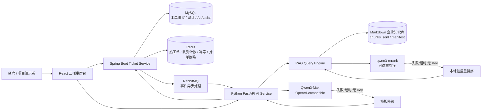
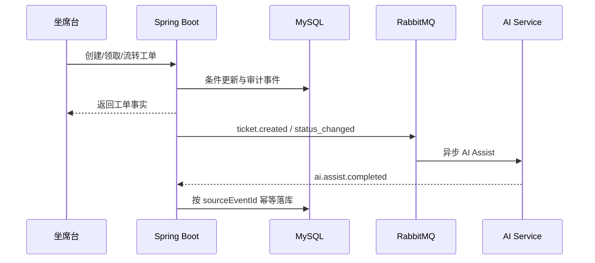
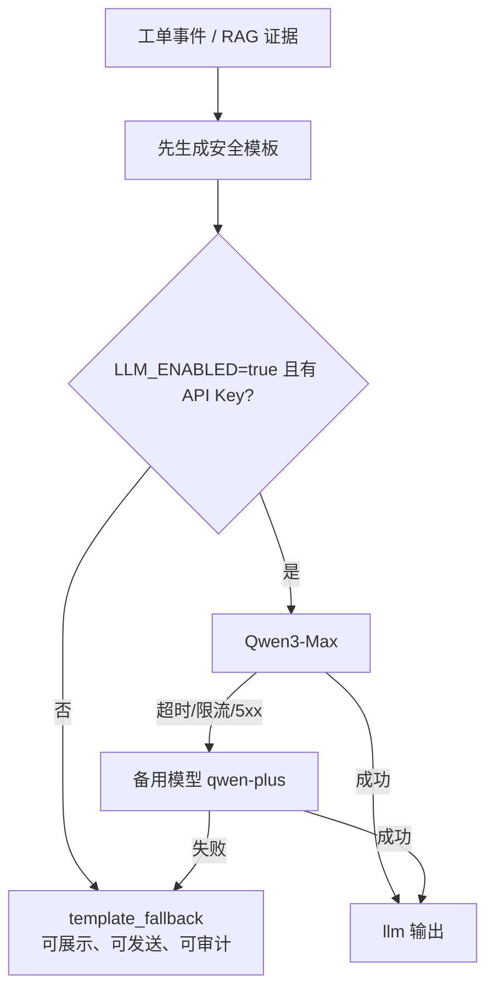
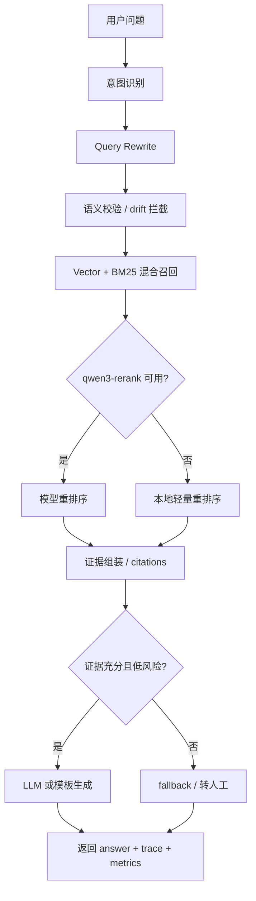

# ContactFlow AI

ContactFlow AI 是一个面向企业客服联络台的工单系统与坐席 AI 辅助原型。项目重点不是做一个简单 Chatbot，而是把 AI Assist、RAG 企业知识库、工单状态机、并发抢单、审计事件、缓存和异步消息放进同一条真实客服业务链路里。

> ContactFlow AI 的核心不是把 LLM 放在客服页面上聊天，而是把 AI 放进客服工单系统。工单主链路由 Spring Boot 和 MySQL 保证一致性，AI Assist 通过异步事件生成，RAG 通过证据引用和评估指标保证可追溯。真实模型接入采用 Qwen3-Max 和 qwen3-rerank，但模型不是强依赖；如果 API Key、网络或模型服务不可用，系统自动降级到模板回复、本地轻量重排序和前端 mock 演示数据，因此项目现场也不会因为 LLM 失败导致页面不可展示。

当前 V0.3.0 版本在 V0.2.0 基础上继续补齐了演示与架构韧性：前端从 3 条 mock 工单扩展到 20 条多类型工单；AI Service 新增 Qwen3-Max 主模型、备用模型和模板降级骨架；RAG 链路新增 qwen3-rerank 可选重排序 Provider，并保留本地轻量重排序作为 fallback。默认配置下不会强依赖外部大模型，因此项目展示时即使网络、API Key 或模型服务不可用，前端仍能完整展示工单、AI Assist 兜底建议和 RAG Evidence Trace。

## 当前定位

这个仓库适合展示以下能力：

- 企业客服工单闭环：创建、领取、状态流转、审计事件、AI Assist 回写。
- 坐席 AI 辅助：意图识别、SLA 风险、转人工建议、建议回复、引用证据。
- RAG 企业知识库：Markdown ingestion、动态切块、父子 chunk、Query Rewrite、混合检索、重排序、citations、fallback、评估指标。
- 工程韧性：LLM 不是主链路依赖，模型失败时自动降级，工单主流程仍可用。
- 项目演示：React 三栏坐席台内置 20 条覆盖不同客服场景的 mock 工单，真实服务失败时仍可展示完整产品形态。

## 总体架构



## 关键链路

### 工单主链路



设计原则：

- MySQL 是工单事实来源，Redis 只做缓存、削峰和短期幂等。
- 工单创建、领取、状态流转不依赖 LLM。
- AI Assist 失败不影响坐席继续处理工单。
- 高风险投诉、赔偿、法律、媒体曝光等场景默认转人工，不自动承诺结果。

### LLM 降级链路



默认 `.env.example` 中 `LLM_ENABLED=false`，因此本地运行不会因为缺少 API Key 或网络导致失败。真实接入时只需要在本地 `.env` 中配置：

```env
LLM_ENABLED=true
LLM_BASE_URL=https://dashscope.aliyuncs.com/compatible-mode/v1
LLM_MODEL=qwen3-max
LLM_FALLBACK_MODEL=qwen-plus
DASHSCOPE_API_KEY=你的本地密钥
```

AI Service 返回中会包含：

- `generationMode`: `llm` 或 `template_fallback`
- `modelName`: 实际使用模型
- `degradedReason`: `llm_disabled`、`missing_api_key`、`llm_timeout`、`llm_http_error:*` 等

## 前端演示设计

前端不是营销页，而是企业坐席工作台。当前内置 20 条 mock 工单，覆盖：

- 物流延迟与投诉
- 退款、换货、保修、质检
- 发票、订阅、跨境税费
- 高风险赔偿、媒体曝光、主管升级
- 无证据权益诉求
- 定制商品、地址变更、丢件、技术故障

前端 mock 不是临时凑数，而是明确作为演示降级层保留：

- 真实 LLM 接通时，右侧 Assist 可被真实结果覆盖。
- LLM 未接通时，仍展示 mock/degraded 建议。
- AI 失败状态可点击“重试并使用兜底”。
- “采纳 Copilot 建议”会把建议回复写入中间回复框。
- “发送回复”会追加到当前工单会话区，用于展示坐席操作闭环。
- 搜索、All/Mine/Escalated 过滤、抢单冲突模拟、状态流转均可交互。

## RAG 知识库能力

当前 RAG 已实现本地可测骨架：

- Markdown 文档解析与 frontmatter 元数据读取。
- 按标题、段落、句子边界进行动态切块。
- token budget 与 overlap 控制，保留上下文窗口。
- parent-child chunk 元数据。
- Query Rewrite 候选生成。
- rewrite 语义相似度和关键词保留率校验，拦截 semantic drift。
- 向量检索 + BM25 混合召回。
- qwen3-rerank Provider 可选接入。
- qwen3-rerank 不可用时降级到本地轻量重排序。
- citations、fallback/handoff、tenant leak count、context recall、faithfulness、citation coverage 等 trace 指标。

RAG 查询链路：



qwen3-rerank 配置：

```env
RERANK_ENABLED=true
RERANK_BASE_URL=https://dashscope.aliyuncs.com/compatible-mode/v1
RERANK_MODEL=qwen3-rerank
DASHSCOPE_API_KEY=你的本地密钥
```

如果 rerank 失败，接口 trace 会显示：

- `rerank_mode=lightweight`
- `rerank_degraded_reason=missing_api_key / rerank_timeout / rerank_http_error / rerank_invalid_response`

## 数据清洗与 ingestion 边界

企业项目真实场景通常会把数据治理拆成单独链路：

- 多源采集：官网、SOP、PDF、飞书、Confluence、CRM、历史工单。
- 清洗规范化：去噪、去重、表格解析、标题补全、版本识别。
- 审批发布：归属人、有效期、权限、灰度、回滚。
- RAG ingestion：切块、embedding、BM25、manifest、索引构建。
- 在线查询：rewrite、retrieve、rerank、generate、trace、feedback。

本项目保留 ingestion 持久化骨架，但不试图把完整知识治理平台都塞进 MVP。当前重点是展示“数据进入 RAG 前需要结构化治理”的架构意识，以及在线 RAG 查询链路如何可追溯、可评估、可降级。

## V0.3 接口规范与边界行为

本次 V0.3 本地更新补齐了发布前需要讲清楚的接口契约和边界行为：

- AI Service `version=0.3.0`，`/assist` 与 `/rag/query` 已增加 Pydantic 字段约束、未知字段拒绝、长度限制和枚举/范围校验。
- Spring Boot 工单 DTO 已增加租户格式、字段长度、置信度范围、耗时非负、成本非负等 Bean Validation 约束。
- Docker Compose 已把 `LLM_*`、`RERANK_*`、`DASHSCOPE_API_KEY` 透传给 AI Service，并增加 AI Service healthcheck。
- Git 增加 `.gitattributes`，约束文本文件编码和换行，保护中文注释、Mermaid 图和接口文档在 GitHub 上稳定展示。
- Makefile 增加 `rag-index` 和 `rag-eval`，方便发布前复验 RAG ingestion 与评估报告。

详细文档：

- [V0.3 接口规范](docs/API_CONTRACT_V0.3.md)
- [V0.3 边界行为说明](docs/EDGE_BEHAVIOR_V0.3.md)

## 技术栈

| 层 | 技术 | 作用 |
| --- | --- | --- |
| 前端 | React, Vite, lucide-react | 三栏坐席台、20 工单演示、AI Assist、Evidence Trace |
| 后端 | Java 17, Spring Boot 3, JPA | 工单状态机、并发抢单、审计、AI Assist 幂等落库 |
| 数据库 | MySQL, Flyway | 工单事实、事件、AI Assist 结果 |
| 缓存 | Redis | 热工单、队列计数、AI 事件幂等、抢单削峰 |
| 消息 | RabbitMQ | ticket.created 与 ai.assist.completed 异步链路 |
| AI Service | Python, FastAPI | 规则引擎、LLM Provider、RAG Query Engine |
| RAG | Markdown, JSONL, BM25, hashing embedding | 本地可测检索骨架与评估 |
| 模型接入 | Qwen3-Max, qwen-plus, qwen3-rerank | 可选真实生成与重排序 |

## 本地启动

三端分别启动：

```powershell
cd ./ai-service
python -m uvicorn app.main:app --host 127.0.0.1 --port 8000
```

```powershell
cd ./backend
mvn spring-boot:run
```

```powershell
cd ./frontend
npm run dev -- --host 127.0.0.1 --port 5173
```

常用链接：

| 服务 | 地址 |
| --- | --- |
| 前端坐席台 | <http://127.0.0.1:5173/> |
| 后端 Swagger | <http://127.0.0.1:8080/docs> |
| 后端工单 API | <http://127.0.0.1:8080/api/tickets?tenantId=tenant-a> |
| AI Service health | <http://127.0.0.1:8000/health> |
| AI Service docs | <http://127.0.0.1:8000/docs> |

## 测试命令

统一复验：

```powershell
make test
make rag-index
make rag-eval
```

```powershell
cd ./ai-service
python -m pytest
```

```powershell
cd ./backend
mvn test
```

```powershell
cd ./frontend
npm run build
```

RAG 索引与评估：

```powershell
cd ./ai-service
python ./eval/build_rag_index.py
python ./eval/run_rag_eval.py
```


## 当前完成度

- [x] Spring Boot 工单领域模型、状态机、并发抢单设计。
- [x] Flyway MySQL 表结构。
- [x] Java 测试用例。
- [x] Python AI Service 规则引擎和测试。
- [x] React 三栏坐席台。
- [x] 前端 20 条多类型演示工单。
- [x] 前端 mock 作为 LLM 不可用时的演示降级层。
- [x] “采纳 Copilot 建议”和“发送回复”本地交互。
- [x] RabbitMQ/Redis 条件化配置与 fallback。
- [x] RAG 动态切块、Query Rewrite、语义校验、混合召回、轻量重排序、评估指标。
- [x] qwen3-rerank 可选 Provider 与本地轻量 rerank fallback。
- [x] Qwen3-Max / qwen-plus 可选 LLM Provider 与模板 fallback。
- [x] `/rag/query` 可追溯检索链路。
- [x] RAG 评估报告落盘。
- [ ] 真实向量库接入。
- [ ] 真实线上知识库治理后台。
- [ ] 前端接后端实时工单列表和真实 AI Assist 拉取。
- [ ] Kafka 事件流扩展。
- [ ] RAG 评估入库与运营面板。
